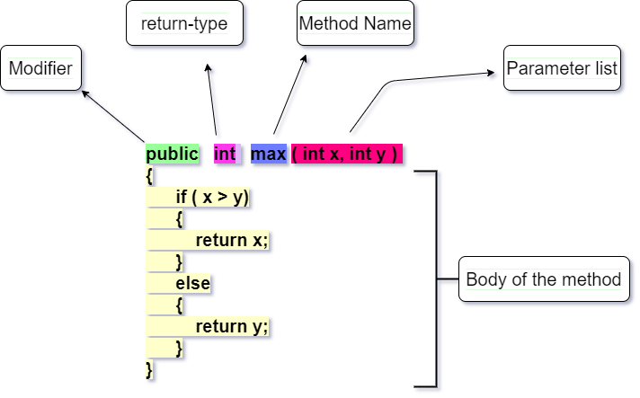

## Java-programming-exercises

1. Age Control Application using &&
2. Exam Result Applciation Using ||
3. Banking Application P1
4. Banking Application P2
5. Banking Application Final Code
6. Swapping two numbers

## Java Methods

7. Access Class (folder)
8. Abstraction
9. Abstraction with Constructor
10. Arithmetic Operations
11. Method Overloading
12. Finding Prime Numbers
13. FizzBuzz
14. String methods and registration application
15. Constructor with getter and setter
16. Inheritance + Employee Application
17. Has A Comparison
